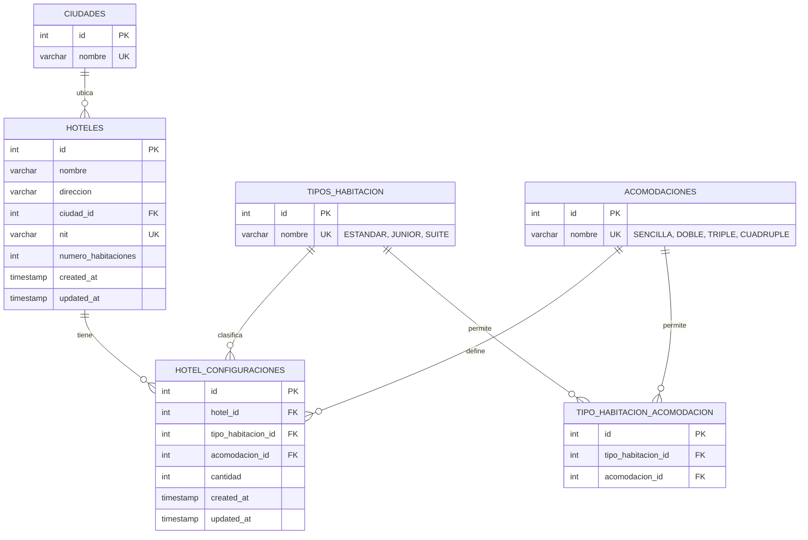

# Modelo Entidad-Relación

```mermaid
erDiagram
    CIUDADES ||--o{ HOTELES : ubica
    TIPOS_HABITACION ||--o{ HOTEL_CONFIGURACIONES : clasifica
    ACOMODACIONES ||--o{ HOTEL_CONFIGURACIONES : define
    TIPOS_HABITACION ||--o{ TIPO_HABITACION_ACOMODACION : permite
    ACOMODACIONES ||--o{ TIPO_HABITACION_ACOMODACION : permite
    HOTELES ||--o{ HOTEL_CONFIGURACIONES : tiene

    CIUDADES {
        int id PK
        varchar nombre UK
    }

    TIPOS_HABITACION {
        int id PK
        varchar nombre UK "ESTANDAR, JUNIOR, SUITE"
    }

    ACOMODACIONES {
        int id PK
        varchar nombre UK "SENCILLA, DOBLE, TRIPLE, CUADRUPLE"
    }

    TIPO_HABITACION_ACOMODACION {
        int id PK
        int tipo_habitacion_id FK
        int acomodacion_id FK
    }

    HOTELES {
        int id PK
        varchar nombre
        varchar direccion
        int ciudad_id FK
        varchar nit UK
        int numero_habitaciones
        timestamp created_at
        timestamp updated_at
    }

    HOTEL_CONFIGURACIONES {
        int id PK
        int hotel_id FK
        int tipo_habitacion_id FK
        int acomodacion_id FK
        int cantidad
        timestamp created_at
        timestamp updated_at
    }
```
